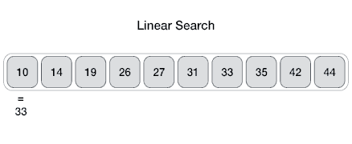

# Arrays and Objects

How does Big O work with Arrays, Objects, and build-in methods? Are there "better" or faster ways to work with these structures in JavaScript?

## Objects

Unordered data structure with key/value pairs. Objects work best when you don't need order or when you need fast access to the data (insertions and removal).
- Insertion: **O(1)**
- Removal: **O(1)**
- Searching: **O(n)**
- Access: **O(1)**

### Object Methods
- [`Object.keys`](https://developer.mozilla.org/en-US/docs/Web/JavaScript/Reference/Global_Objects/Object/keys): **O(n)**
- [`Object.values`](https://developer.mozilla.org/en-US/docs/Web/JavaScript/Reference/Global_objects/Object/values#:~:text=Description-,Object.,values%20of%20the%20object%20manually.): **O(n)**
- [`Object.entries`](https://developer.mozilla.org/en-US/docs/Web/JavaScript/Reference/Global_Objects/Object/entries): **O(n)**
- [`Object.hasOwnProperty`](https://developer.mozilla.org/en-US/docs/Web/JavaScript/Reference/Global_Objects/Object/hasOwnProperty): **O(1)**

_To learn more about how objects work behind the scenes, visit the section on [hashmaps](../hashmap/notes-hashmap.md)._

## Arrays

Arrays can be thought about as ordered lists. Best used when you need order or when you need fast access/insertion and removal. Sometimes.
- Insertion: It depends...
  - If we're adding to the end (`array.push()`), this is **O(1)**.
  - If we're adding to the beginning (`array.shift()`), we need to reindex the entire array, which means **O(n)**.
- Removal: It depends...
  - If we're removing from the beginning (`array.unshift()`), we need to reindex the entire array, which means **O(n)**.
  - If we're removing from the end (`array.pop()`), this is **O(1)**.
- Searching: **O(n)**
- Access: **O(1)**

### Array Methods
- [`push`](https://developer.mozilla.org/en-US/docs/Web/JavaScript/Reference/Global_Objects/Array/push): **O(1)**
- [`pop`](https://developer.mozilla.org/en-US/docs/Web/JavaScript/Reference/Global_Objects/Array/pop): **O(1)**
- [`shift`](https://developer.mozilla.org/en-US/docs/Web/JavaScript/Reference/Global_Objects/Array/shift): **O(n)**
- [`unshift`](https://developer.mozilla.org/en-US/docs/Web/JavaScript/Reference/Global_Objects/Array/unshift): **O(n)**
- [`concat`](https://developer.mozilla.org/en-US/docs/Web/JavaScript/Reference/Global_Objects/Array/concat): **O(n)**
- [`slice`](https://developer.mozilla.org/en-US/docs/Web/JavaScript/Reference/Global_Objects/Array/slice): **O(n)**
- [`splice`](https://developer.mozilla.org/en-US/docs/Web/JavaScript/Reference/Global_Objects/Array/splice): **O(n)**
- [`sort`](https://developer.mozilla.org/en-US/docs/Web/JavaScript/Reference/Global_Objects/Array/sort): **O(n log n)**
- [`forEach`](https://developer.mozilla.org/en-US/docs/Web/JavaScript/Reference/Global_Objects/Array/forEach), [`map`](https://developer.mozilla.org/en-US/docs/Web/JavaScript/Reference/Global_Objects/Array/map), [`filter`](https://developer.mozilla.org/en-US/docs/Web/JavaScript/Reference/Global_Objects/Array/filter), [`reduce`](https://developer.mozilla.org/en-US/docs/Web/JavaScript/Reference/Global_Objects/Array/reduce), etc.: **O(n)**

#### [Back to Home](../../README.md)